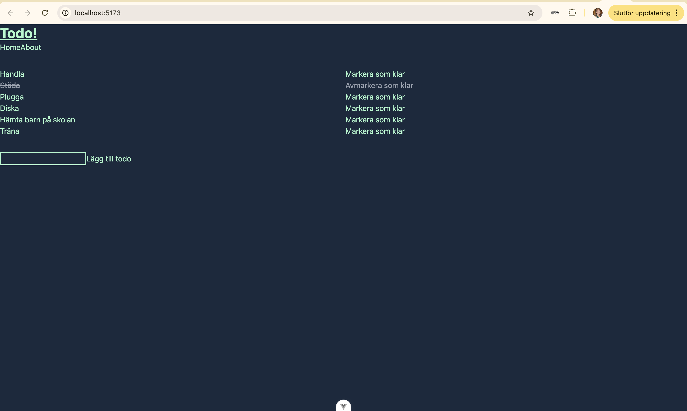

# todo
Detta projekt är en enkel todo-applikation skapad med Vue för att lära sig grunderna i Vue-ramverket. I appen kan användaren lägga till uppgifter i en lista och markera dem som "klara". När en uppgift markeras som klar, stryks den över för att visa att den är färdig.

---
## Systemkrav

- Node.js >= 16

- npm >= 8

---
## Installation
För att installera nödvändiga beroenden, kör följande kommando:
```sh
npm install
```

### Starta utvecklingsservern:
För att starta servern och börja utveckla lokalt, kör:
```sh
npm run dev
```

### Bygg för produktion:
För att skapa en produktionsklar version av appen, kör:
```sh
npm run build
```

### Lint-kontroll med ESLint:
För att köra ESLint och kontrollera kodens kvalitet, kör:
```sh
npm run lint
```
### Formatera kod med Prettier:
För att köra Prettier och automatiskt formatera koden, kör:
```sh
npm run format
```
---
## Kodkvalitet
I projektet har jag använt ESLint och Prettier för att säkerställa enhetlig kodstil och undvika vanliga kodproblem:

- ESLint hjälper till att identifiera problem i koden som kan påverka funktionalitet och läsbarhet.
- Prettier formaterar koden för att säkerställa konsekvent stil och förbättra läsbarheten.

---
## Färdiga projektet
